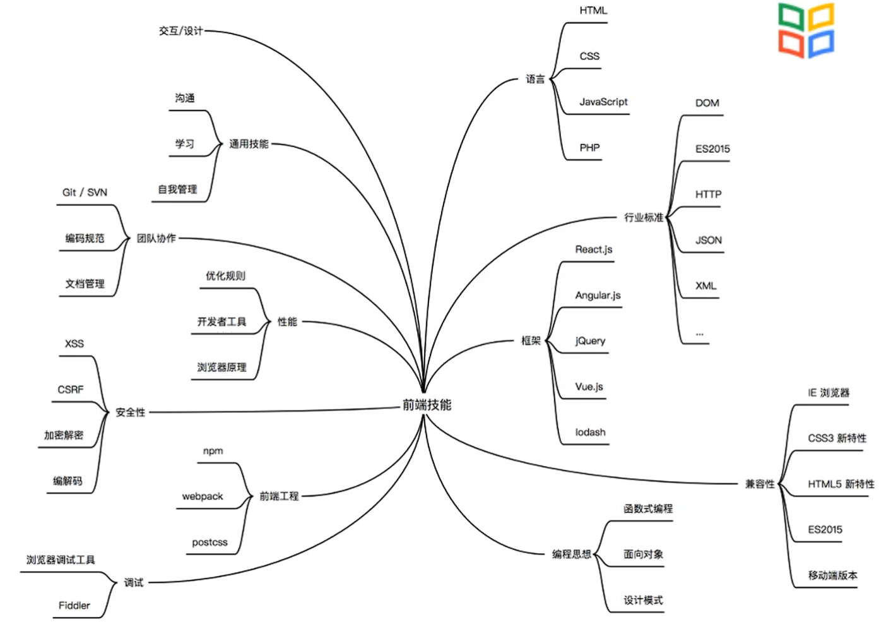
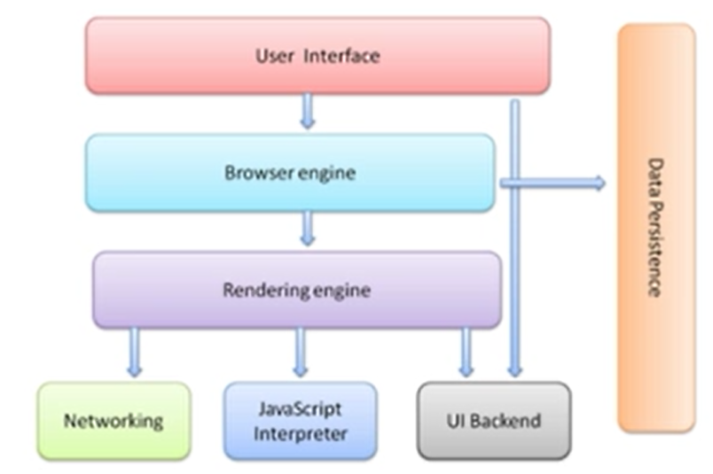
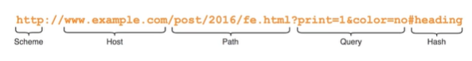
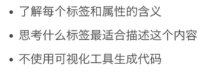
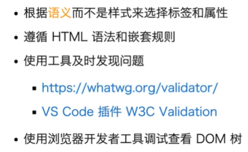
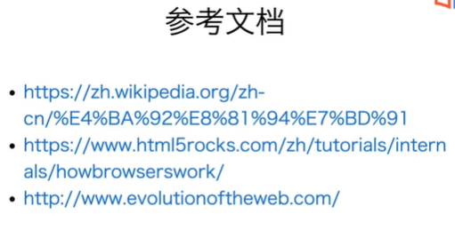

[TOC]


# 概论




各种功能：

node.js

react native

webgl游戏


编辑器：Vs Atom Vim WebStorm

浏览器：整体架构类似，渲染引擎和js引擎不同。内置了调试工具。console日志/网络请求等。




# html

什么是 HTML？HTML 是 Hyper Text Markup Language 的简写，译成中文是「**超文本标记语言**」。

顾名思义，超文本，就是不止于文本，视频、音频、图片等等都可以，说到底就是一种特殊的文档。HTML 构建了一个网页的基本骨架，TA 是用来描述网页的一种语言。


除了<hr/>、 、<input/> 等少部分自闭合标签外，元素的开始标签和结束标签必须成对出现，例如：<html></html>。

```html
<!DOCTYPE html>
<html>
<head>
<meta charset="utf-8">
<title>菜鸟教程(runoob.com)</title>
</head>
<body>
    <h1>我的第一个标题</h1>
    <p>我的第一个段落。</p>
</body>
</html>
```


调试页面可以看到html页面的dom树。


## 语法

### 标签的分类

https://www.runoob.com/tags/ref-byfunc.html

``` html
<!DOCTYPE html>


```

图片img注意alt是必需属性

<blockquote>

###### 文本类标签

**链接**

<a href = "url">

**url**



省略协议：按当前页面的来

只保留路径：同理

路径：

绝对路径：/开头

相对路径：会被解析到当前路径的文件夹下

页面内滚动：用hash和id

**引用**

**强调**

空白符，换行，会被合并成一个空格。

不想合并，加上<pre>标签，保留空格和换行。

或者使用实体字符，方便进行转义处理。&lt,&gt:<>

标签分类


###### 多媒体类标签

###### 组织页面

article&section：都可以有foot,header

有序列表：

无序列表：<ul>,可以嵌套

定义列表：description list,<dl>；<dt>,term；<dd>；dt和dd多对多

导航：nav，长什么样啊

相关推荐/广告<aside> 


###### HTML表格

表格由 <table> 标签来定义。每个表格均有若干行（由 <tr> 标签定义），每行被分割为若干单元格（由 <td> 标签定义）。字母 td 指表格数据（table data），即数据单元格的内容。数据单元格可以包含文本、图片、列表、段落、表单、水平线、表格等等。

表格的表头使用 <th> 标签进行定义。

大多数浏览器会把表头显示为粗体居中的文本。

跨行:rowspan = "2"，到下一个tr，可以跳过这个td不重复写。

https://www.runoob.com/html/html-tables.html

###### 表单：需要填写

<input type = "" placeholder(占位字符)>

input type = "radio"，name相同时，是单选

input type = "checkbox"

属性checked（默认选中）

选项比较多（下拉选择框）：<select name> <option value> ，默认选中selected

按钮 <button type="submit"/"button">

多行textarea placeholder

https://www.w3school.com.cn/html/html_forms.asp


###### 

### html语义化：方便调试，盲人阅读



比如标题就用标题，不用p。


### html可扩展性

data-id

meta标签 https://www.runoob.com/tags/tag-meta.html

link （引入外部文件，例如css样式，图片（预先加载，优化性能））

microdata：长篇加累版牍,不好理解。微标记来标注其中内容,让其容易识辨。方便浏览器进行网站的内容抓取。


### html规范

需要注意各个标签嵌套规则，语义。

div不能放p里面。

https://whatwg.org/validator/







[HTML 标签列表(字母排序) | 菜鸟教程 (runoob.com)](https://www.runoob.com/tags/html-reference.html)