[TOC]


# 概论


各种功能：

node.js

react native

webgl游戏


编辑器：Vs Atom Vim WebStorm

浏览器：整体架构类似，渲染引擎和js引擎不同。内置了调试工具。console日志/网络请求等。


# html

什么是 HTML？HTML 是 Hyper Text Markup Language 的简写，译成中文是「**超文本标记语言**」。

顾名思义，超文本，就是不止于文本，视频、音频、图片等等都可以，说到底就是一种特殊的文档。HTML 构建了一个网页的基本骨架，TA 是用来描述网页的一种语言。


除了<hr/>、 、<input/> 等少部分自闭合标签外，元素的开始标签和结束标签必须成对出现，例如：<html></html>。

```html
<!DOCTYPE html>
<html>
<head>
<meta charset="utf-8">
<title>菜鸟教程(runoob.com)</title>
</head>
<body>
    <h1>我的第一个标题</h1>
    <p>我的第一个段落。</p>
</body>
</html>
```


调试页面可以看到html页面的dom树。


## 语法

### 标签的分类

https://www.runoob.com/tags/ref-byfunc.html

``` html
<!DOCTYPE html>


```

图片img注意alt是必需属性

<blockquote>

###### 文本类标签

**链接**

<a href = "url">

**url**


省略协议：按当前页面的来

只保留路径：同理

路径：

绝对路径：/开头

相对路径：会被解析到当前路径的文件夹下

页面内滚动：用hash和id

**引用**

**强调**

空白符，换行，会被合并成一个空格。

不想合并，加上<pre>标签，保留空格和换行。

或者使用实体字符，方便进行转义处理。&lt,&gt:<>

标签分类


###### 多媒体类标签

###### 组织页面

article&section：都可以有foot,header

有序列表：

无序列表：<ul>,可以嵌套

定义列表：description list,<dl>；<dt>,term；<dd>；dt和dd多对多

导航：nav，长什么样啊

相关推荐/广告<aside> 


###### HTML表格

表格由 <table> 标签来定义。每个表格均有若干行（由 <tr> 标签定义），每行被分割为若干单元格（由 <td> 标签定义）。字母 td 指表格数据（table data），即数据单元格的内容。数据单元格可以包含文本、图片、列表、段落、表单、水平线、表格等等。

表格的表头使用 <th> 标签进行定义。

大多数浏览器会把表头显示为粗体居中的文本。

跨行:rowspan = "2"，到下一个tr，可以跳过这个td不重复写。

https://www.runoob.com/html/html-tables.html

###### 表单：需要填写

<input type = "" placeholder(占位字符)>

input type = "radio"，name相同时，是单选

input type = "checkbox"

属性checked（默认选中）

选项比较多（下拉选择框）：<select name> <option value> ，默认选中selected

按钮 <button type="submit"/"button">

多行textarea placeholder

https://www.w3school.com.cn/html/html_forms.asp


###### 

### html语义化：方便调试，盲人阅读


比如标题就用标题，不用p。


### html可扩展性

data-id

meta标签 https://www.runoob.com/tags/tag-meta.html

link （引入外部文件，例如css样式，图片（预先加载，优化性能））

microdata：长篇加累版牍,不好理解。微标记来标注其中内容,让其容易识辨。方便浏览器进行网站的内容抓取。


### html规范

需要注意各个标签嵌套规则，语义。

div不能放p里面。

https://whatwg.org/validator/


[HTML 标签列表(字母排序) | 菜鸟教程 (runoob.com)](https://www.runoob.com/tags/html-reference.html)


# css

在页面中使用css

更推荐使用外链，方便代码维护


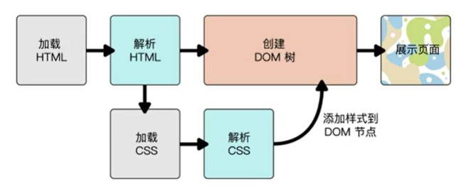


代码风格：推荐编码之间空一行

调试css：elements style


## 语法

###### 选择器

1. *：通配选择器，页面中所有的

2. 标签选择器

3. id选择器：#+id，id是唯一的

4. 类选择器：.+class，class一个页面中可以出现多次

5. Hypertext Reference：href  属性选择器：可以选择href以...开头/结尾的选择

6. 伪类：

   + 动态伪类：a:link/visited/hover/active。:focus(input)

   + 结构性伪类：列表项中第一个/最后

7. 组合器

   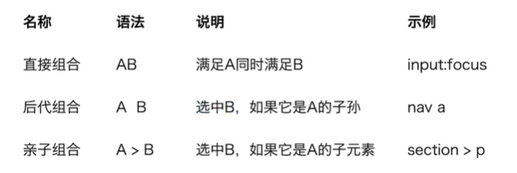

亲子关系/后代关系可以多个连着 A B C


###### 字体

英文字体和中文如果不同，英文放前面

@font-face{}

字体大小：可以用相对大小，font-size 80%,2em

字体粗细font-weight：还有关键字normal,bold。有的字体不支持某些字重

行高line-height：如果没有单位，就是字体大小的数字倍数

上面的属性，可以用font一起设置，可以缺省

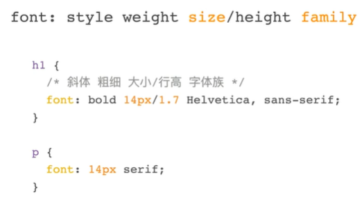


###### 文字样式

justify（两端对齐）/left/center/right

spacing：letter-spacing,word-spacing

text-indent首行缩进

text-decoration：none/underline/line-through/overline

white-space：换行符是否合并，是否和源代码一样，pre-wrap显示不下自动换行pre不换

text-shadow


###### 盒模型

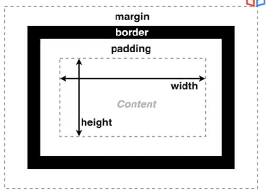

padding：内边距，顺序，上右下左，如果是两个的话会自动设置。百分数是相对于宽度

border：可以组合设置（各个边框颜色不同），可以通过border模拟三角形

margin：auto 水平居中，可以为负的


margin collapse:垂直方向上，相邻的边距会取较大的那个合并

box-sizing：border-box

overflow：内容溢出 visible/hidden/scroll

min-width,max-width：限制

em单位：字符


**块级&行级：**

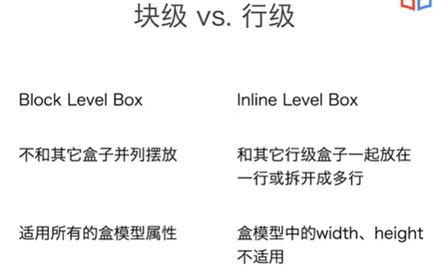

行级不能设置高度宽度

inline-block，可以设置宽高，不被拆行（总是在一行，不会被拆）


**盒子的效果**

圆角：上右下左，也可以设置椭圆，百分比 a b c d/ e f g h（水平方向的半径&垂直方向）

background-color

background-image,background-repeat背景图像的排布

background-position：top/left/center，bottom right，50% 50%（指把图片50%和盒子50%重合）

background-size:cover/contain/percentage

background-clip：背景覆盖范围

以上属性可以用background一个属性写，可以缺省

box-shadow（不占用空间）


**行高和垂直对齐**

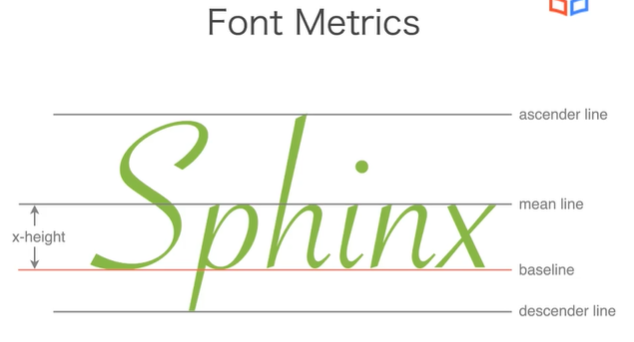


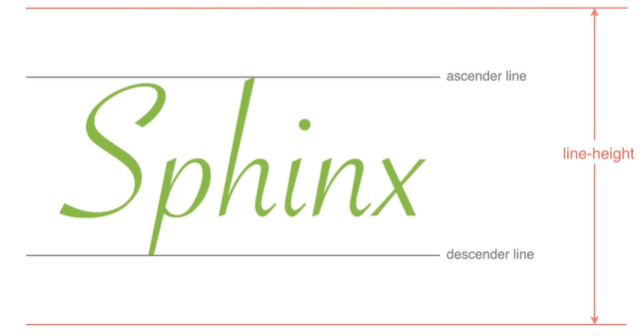

line box内盒子摆放都是baseline对齐

不同盒子baseline稍有不同


###### 选择器的特异度

高优先级的会覆盖低优先级的。有些属性会自动集成父元素的计算值。

显式集成：例如给box-sizing :inherit，使它可以继承

可利用这个特性实现代码复用。

优先级计算：id*100 + 伪/class\*10 + 元素\*100


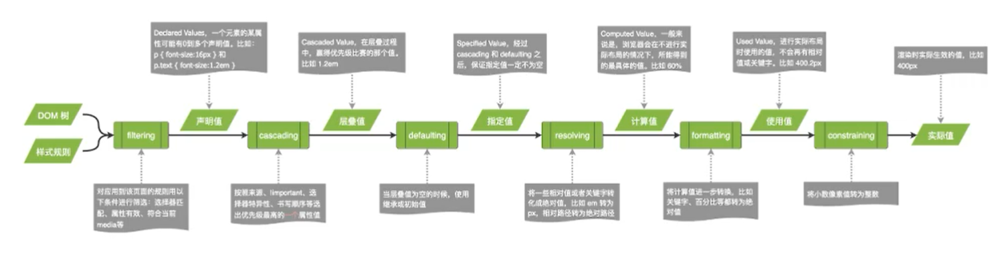


###### 值和单位

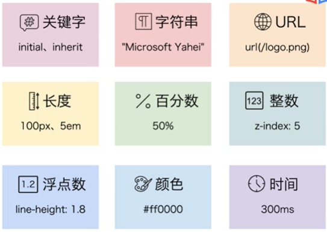

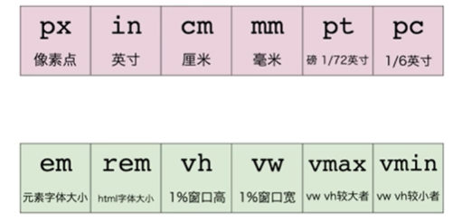

rem中html font默认16px

颜色：

+ #e1e1e1 两个十六进制数 rgb三个数连着
+ hsl
+ keyword  
+ alpha透明度：0-1，直接加rgb/hsl后面，变成rgba/hsla

时间：s/ms


https://bbs.huaweicloud.com/blogs/319622#:~:text=%E8%A1%8C%E7%BA%A7%E6%8E%92%E7%89%88%E4%B8%8A%E4%B8%8B%E6%96%87%E6%98%AF,%E4%B8%80%E8%A1%8C%E6%91%86%E4%B8%8D%E4%B8%8B%E5%B0%B1%E6%8D%A2%E8%A1%8C


### 布局

**flex-box:单向**

流中的盒子只能全是行级/块级

flex-wrap: wrap 允许换行

flex-grow: 占满剩余空间的能力，剩余空间按比例分配

flex-shrink: 0 不能收缩

flex-basis:  content/percentage没有收缩没有扩展的时候

也可以集合起来写

.a ,.b ,.c{}


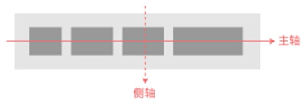

主轴方向 justify-content 主轴方向上靠头/尾/居中

align-items:一行/列默认stretch

align-self:给某个子元素加，.a

align-content:每行整行都....

order:从小到大排序，某个子元素


**grid布局**

划分网络：

fr:份数

1fr 1fr：平均分

grid-template

选择网格：gird-area

命名网格线/网格区域：grid-template

网格间距：grid-gap

justify-content /align-items/aligh-self/justify-self：同flex-box


**表格样式**

【table是flex-box和grid之前的。一般布局更推荐用后面两个】

display：table

表格宽度

边框

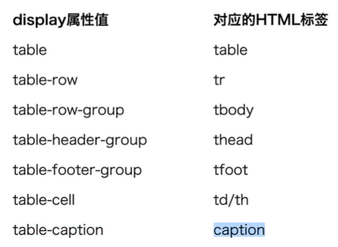


**浮动**

float

clear：不会和...重叠

overflow：hidden 文字不会环绕图片，不会上下重叠，创建BFC

**定位**

position: relative 其他元素位置不受这个元素位置影响

absolute：相对于最近的非static祖先定位

fixed：相对于窗口


**堆叠**

z-index：大的在上

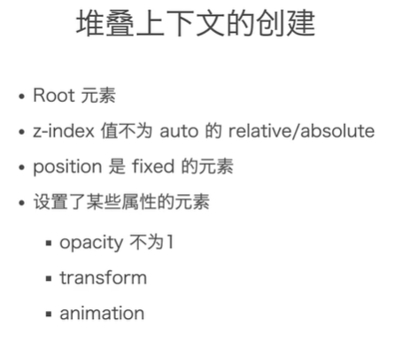


**动画**

transform 

perspective

translate3d


transition

延迟


keyframe


### 响应式设计

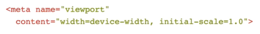

适应手机

一般情况下设置max-width:100%即可

背景图片 contain,cover是裁掉多余的

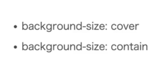


媒体查询

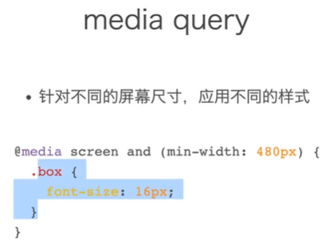


图片使用，节省流量，使用不同尺寸的图片

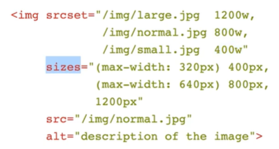


屏幕较小时，改变根的font-size，然后其他的字体大小用rem单位


层叠机制

浏览器注释，浏览器怪癖

浏览器前缀：特性不稳定时使用前缀


